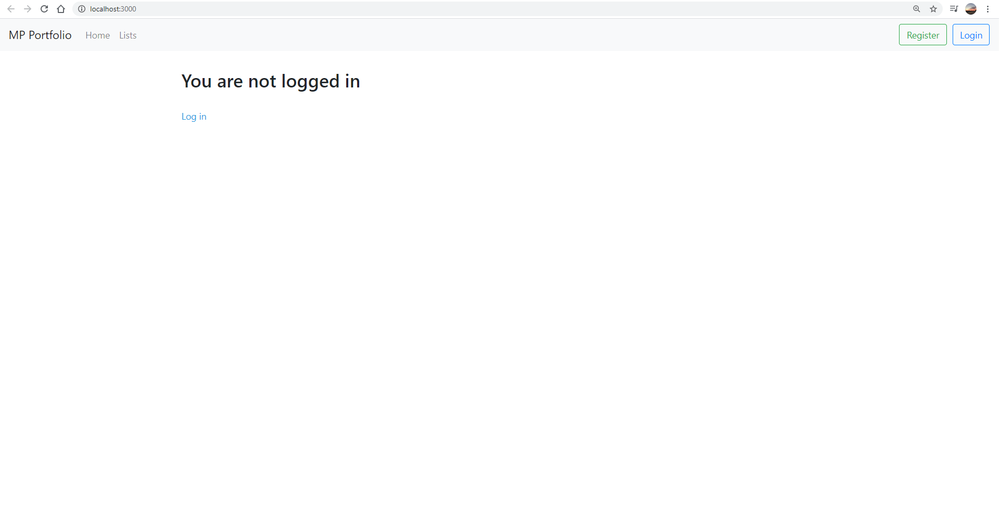
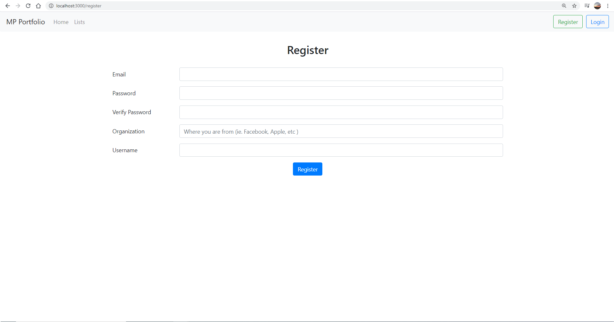
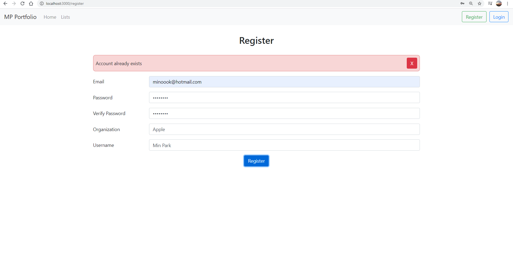
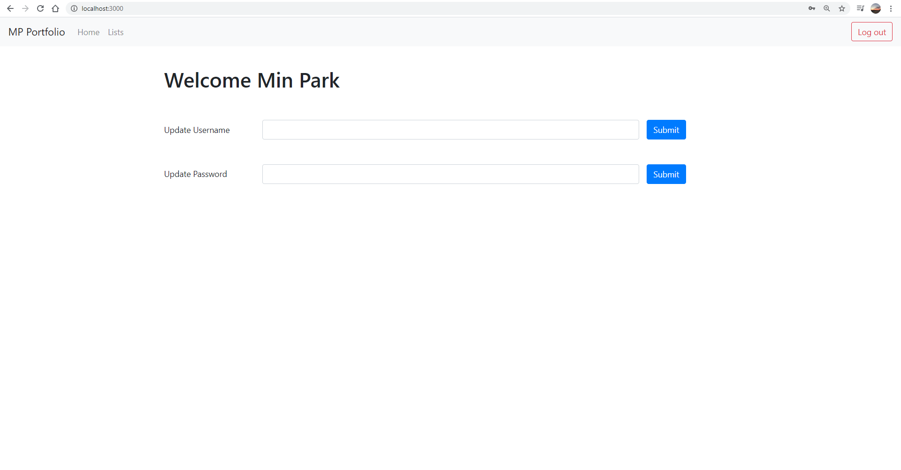
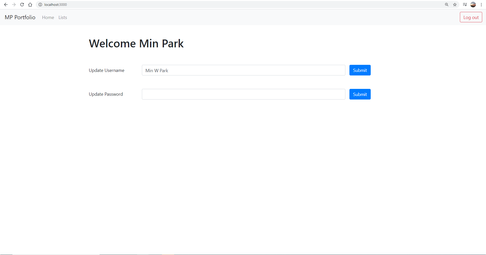
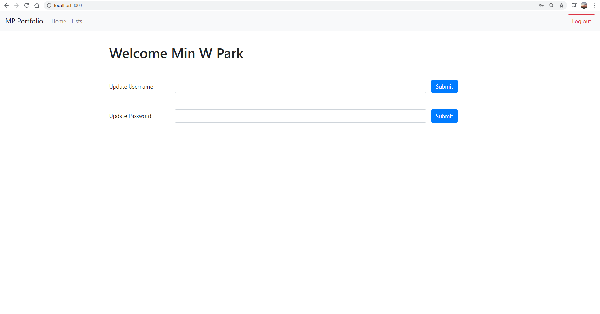
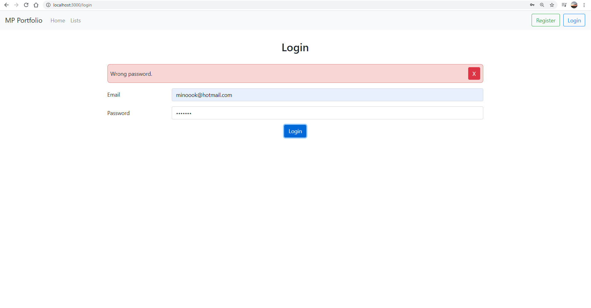

# MERN

Login page using MongoDB, Express.js, React, Node.js 

1. Main page

2. Register Page (Top Right)

3. Register Error
  - If email is already taken
  - If password is less than 5 characters and password and Verify password do not match
  - If username is less than 3 characters
  - If organization name is less than 3 characters and longer than 10 characters

4. Page after login

5. Changing username

6. Username changed

7. Login error

